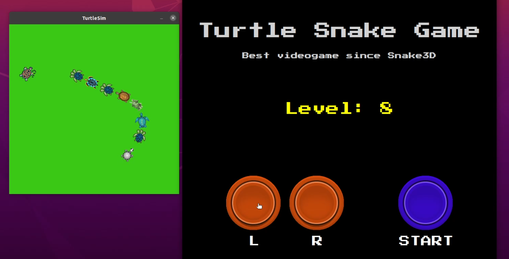

# Turtle Snake Game
Game similar to the mythical snake game. Programmed in **Python 3** using the **ROS** libraries and turtlesim tool.
The version of ROS used in this project is ***ROS Noetic***.

<p align="center"></p>

Gameplay video: https://youtu.be/EjjR5Xkh8b0

## Game Features
- Web control panel to interact with the game *(Rosbridge & roslibjs)* using the buttons on the page or even the arrow keys!
- Display of the current game level
- Automatic turtle spawning when one is caught
- Background color change when a turtle is caught
- Collision detection of the main turtle with the following ones
- Collision detection of the main turtle with the game window walls
- Possibility of restarting the game when the game is over.

## Installation
### Prerequesites
You will need to have ROS & Python installed on your operating system. This project has been developed using:
- [ROS Noetic](http://wiki.ros.org/noetic/Installation/Ubuntu)
- [Ubuntu Focal (20.04)](https://releases.ubuntu.com/focal/)
- [Python 3.8.10](https://www.python.org/downloads/release/python-3810/)

### Package installation
Open terminal and navigate to src folder in your catkin workspace:
```sh
cd ~/catkin_ws/src
```
Then clone the repository using:
```sh
git clone https://github.com/AngelLM/learning_tf
```
Once it is completed, do the following:

```sh
cd ~/catkin_ws 
catkin_make
```

## Execution

To run the game, open a terminal and execute the following command:
```sh
roslaunch learning_tf start_demo.launch
```
Then navigate to the folder `~/catkin_ws/src/learning_tf/web-controller` and open the file **controller.html** or open a new terminal and execute the following command:
```sh
firefox ~/catkin_ws/src/learning_tf/web-controller/controller.html
```
With the control panel open you can now click on the START button to start the game. With the LEFT and RIGHT buttons you can control the rotation of the main turtle. 
You can also use the left and right arrow keys on your keyboard to control the turtle!
Enjoy!